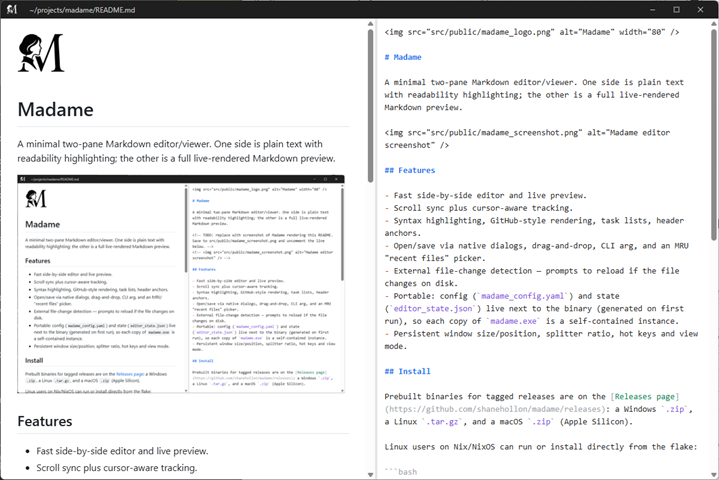

# Madame


A minimal two-pane Markdown editor/viewer. One side is plain text with readability highlighting; the other is a full live-rendered Markdown preview.

<!-- TODO: replace with screenshot of Madame rendering this README. Save to src/public/madame_screenshot.png and uncomment the line below. -->
<!--  -->

## Features

- Fast side-by-side editor and live preview.
- Scroll sync plus cursor-aware tracking.
- Syntax highlighting, GitHub-style rendering, task lists, header anchors.
- Open/save via native dialogs, drag-and-drop, CLI arg, and an MRU "recent files" picker.
- External file-change detection — prompts to reload if the file changes on disk.
- Portable: config (`madame_config.yaml`) and state (`editor_state.json`) live next to the binary (generated on first run), so each copy of `madame.exe` is a self-contained instance.
- Persistent window size/position, splitter ratio, hot keys and view mode.

## Install

Prebuilt binaries for tagged releases are on the [Releases page](https://github.com/shanehollon/madame/releases): a Windows `.zip`, a Linux `.tar.gz`, and a macOS `.zip` (Apple Silicon).

Linux users on Nix/NixOS can run or install directly from the flake:

```bash
nix run github:shanehollon/madame                   # one-shot
nix profile install github:shanehollon/madame       # add to user profile
```

The flake fetches the prebuilt Linux tarball from the matching GitHub Release, so no source build is required.

## Configuration

First run creates `madame_config.yaml` next to the binary. Notable keys:

- `ui.editor_position` — `left|right` (default: `right`).
- `preview.debounce_ms` — live-preview render debounce.
- `preview.scroll_sync` — toggle scroll sync.
- `editor`
  - `word_wrap`
  - `tab_size`
  - `tab_inserts_spaces`
  - `font_size`
  - `font_family`
- `keybindings.*` — see the table below.

## Keyboard shortcuts (defaults)

| Shortcut         | Action                      |
| ---------------- | --------------------------- |
| `Ctrl+O`         | Open file                   |
| `Ctrl+S`         | Save                        |
| `Ctrl+Shift+S`   | Save As                     |
| `Ctrl+R`         | Recent files                |
| `Ctrl+E`         | Toggle editor-only view     |
| `Ctrl+Shift+E`   | Toggle preview-only view    |

## Building from source

See [CONTRIBUTING.md](CONTRIBUTING.md).
